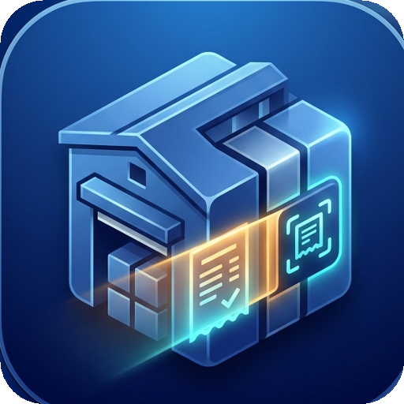

<p align="center">
  
</p>

<h1 align="center">GodownTrack POS</h1>

<p align="center">
  <b>Enterprise Warehouse Inventory Management, Fast Dispatch &amp; Dual-Width Bluetooth Thermal Printing System</b>
</p>

<p align="center">
  
  
  
  
  
  
</p>

---

## 📖 Overview

**GodownTrack POS** (formerly BH POS) is an industrial-grade, offline-first mobile Point of Sale (POS) and inventory dispatch application designed for warehouses, godowns, distribution depots, and wholesale stockyards.

Built with a high-performance **hybrid architecture** combining a native **Kotlin Android** host with a modern, responsive **Material 3 / Tailwind CSS** interface, GodownTrack delivers instantaneous (0ms) local feedback while maintaining real-time bidirectional synchronization with a multi-tenant **Supabase** PostgreSQL cloud.

Whether operating in high-speed contractor pickup lanes, conducting stock-in receiving at the docks, or generating physical gate passes on battery-powered thermal printers, GodownTrack ensures continuous operations with zero downtime.

---

## ✨ Key Highlights

- **⚡ Instant 0ms Optimistic UI:** All cart additions, stock adjustments, and slip edits update on screen immediately, persisting asynchronously to the cloud.
- **🖨️ Dual-Width ESC/POS Engine:** Supports both 58mm (32-column) and 80mm (48-column) Bluetooth receipt printers with per-device paper size memory and silent auto-failover to backup printers.
- **📦 Multi-Godown Warehouse Tracking:** Manage multiple godown locations and warehouse bays from a single account without data segregation hassles.
- **☁️ Multi-Tenant SaaS Architecture:** Business registration with password protection, staff PIN accounts, and real-time push synchronization across unlimited concurrent devices.
- **🖼️ In-App Photo Compression & Sync:** Fast product photo capture with client-side canvas compression (max 350×350 px JPEG Data URLs, ~15 KB) stored directly in the database for instant cross-device visibility.
- **🔄 Reversible Transactions & Delta Stock Recalculation:** Editing a dispatch slip recalculates stock based strictly on the mathematical delta (`newQty - oldQty`), preventing accidental stock loss or double-deductions. Trashing a slip automatically returns goods to stock.

---

## 🚀 Core Features

### 1. 📦 Inventory & Multi-Warehouse Tracking
- **Universal Catalog:** Manage bags, boxes, metric tons (MT), kilograms, liters, rolls, and units.
- **Godown Bay Allocation:** Filter inventory, dispatch ledgers, and telemetry by individual warehouse bays (`Godown 1`, `Godown 2`, etc.) or view aggregated metrics across `All Godowns`.
- **Item Lifecycle Management:** Long-press any product card to edit name, base rate per unit, bay location, or toggle active/disabled states (with grayscale visual indicator).
- **Instant Product Creation:** Dedicated "+ Add Product" tile for blank-slate onboarding and immediate stock-in.

### 2. ⚡ POS Terminal & Quick Dispatch
- **Speed Add Buttons:** Quick +1, +5, and +10 quantity buttons with haptic feedback.
- **Dynamic Responsive Grid:** Fluid layout adapting from 2 columns on mobile screens up to 6 columns on tablets and widescreen POS terminals.
- **Visual Typography:** Large, prominent stock counts (`18px font-black`) with compact, clean price badges.
- **Live Cart Badge:** Real-time badge counter updating instantly as items are selected.

### 3. 🚚 Detailed Gate Dispatch & Challan Management
- **Multi-Item Dispatch Cart:** Add diverse items to a single dispatch order with subtotal calculation.
- **Full Contractor & Freight Metadata:**
  - Buyer / Party selection or on-the-fly customer creation (name, phone, GSTIN).
  - Vehicle Number & Driver Name / Phone.
  - Delivery Challan Number & E-Way Bill (EWB) Number.
  - Destination site / unloading point.
- **Live Slip Preview:** Visual digital receipt showing all details before committing or printing.

### 4. 🖨️ Enterprise Bluetooth Thermal Printing
- **Native ESC/POS Driver:** Direct Bluetooth RFCOMM socket streaming with 3-tier fallback connection routines.
- **Paper Size Memory:** Automatically remembers whether a paired printer operates on 58mm or 80mm roll width per MAC address, generating the exact matching column layout dynamically.
- **Multi-Device Failover Engine:** If a primary printer (e.g. SR588) runs out of battery or goes offline, print jobs silently route to secondary active thermal printers (e.g. MPT-III) with automatic preferences update.
- **Hardware Buffer Protection:** Extended delays (4.5s) and non-blocking streaming prevent buffer drops and truncated receipts on budget 58mm printers.
- **Customizable Slip Blocks:** Toggle Header Logo, Godown Bay, Operator Name, Unit Pricing, QR Validation Box, and Signature Lines directly from the Thermal Settings modal.

### 5. ☁️ Multi-Tenant Cloud & Realtime Synchronization
- **Supabase Integration:** Backed by PostgreSQL with Row Level Security (RLS) support.
- **Tenant Isolation:** Complete data separation per business tenant using UUID `business_id` scoping.
- **Realtime WebSockets:** Subscribes to Postgres change feeds (`INSERT`, `UPDATE`, `DELETE`) on `products`, `transactions`, and `parties` tables for instant cross-device updates.
- **Offline Cache:** Local memory cache ensures full checkout capability even when internet connectivity drops.

### 6. 🔒 Staff PIN Authentication & Security
- **Secure Onboarding:** Password-protected business linking prevents unauthorized staff from attaching personal devices.
- **4-Digit Quick PIN Keypad:** Fast staff switching with on-screen numeric keypad and tactile haptic response.
- **Role Scoping:** Distinguish between `admin` (catalog edits, settings) and `staff` operators.

### 7. 📊 Transaction Ledger & Stock Audit
- **Chronological Audit Trail:** Unified ledger tracking both Outward (Dispatch) and Inward (Stock-In) slips sorted descending by timestamp.
- **Inward Stock Unloading:** Record incoming stock from factories/vendors with batch number and destination bay allocation.
- **Safe Slip Editing:** Edit driver details, vehicle numbers, destinations, or item counts with mathematical delta stock re-computation.
- **Slip Trashing:** Dedicated red confirmation modal with permanent transaction removal and automatic stock restoration.

---

## 🛠️ Architecture & Tech Stack

```text
┌─────────────────────────────────────────────────────────────┐
│                 GodownTrack Mobile Client                   │
├──────────────────────────────┬──────────────────────────────┤
│    Frontend Web View Layer   │     Native Android Layer     │
│  • HTML5 / Material 3        │  • Kotlin 2.1.0 Host         │
│  • Tailwind CSS              │  • BluetoothPrinterManager   │
│  • ES6 Modular JavaScript    │  • EscPosSlipGenerator       │
│  • Canvas Image Compressor   │  • SharedPreferences Cache   │
│  • Supabase JS Client        │  • WebChrome File Chooser    │
└──────────────┬───────────────┴──────────────┬───────────────┘
               │                              │
         REST / WebSockets             Bluetooth RFCOMM
               │                              │
               ▼                              ▼
┌──────────────────────────────┐ ┌────────────────────────────┐
│    Supabase Cloud Backend    │ │  Bluetooth Thermal Printer │
│  • PostgreSQL Database       │ │  • MPT-III (80mm)          │
│  • Realtime Push Channels    │ │  • SR588 / POS-58 (58mm)   │
│  • Row Level Security (RLS)  │ │  • ESC/POS Protocol       │
└──────────────────────────────┘ └────────────────────────────┘
```

### Module Breakdown (`app/src/main/assets/js/`)
- `app.js`: Main application controller, tab router, startup splash coordinator, and dashboard telemetry metrics.
- `catalog_pos.js`: Catalog rendering, POS cart state, product creation/editing, image uploader, and canvas compression.
- `dispatch.js`: Multi-item dispatch order builder, customer modal, slip editor, and stock delta calculations.
- `thermal_printer.js`: Bluetooth printer manager, paired device discovery, paper width settings, and ESC/POS preview.
- `cloud_sync.js`: Two-way cloud synchronization, background polling, and Supabase Realtime channel subscriptions.
- `supabase_auth.js`: Business tenant registration, staff login, and 4-digit PIN verification.

---

## 📋 Database Setup (Supabase)

To link GodownTrack POS to your own Supabase instance:

1. Create a new project in the [Supabase Dashboard](https://supabase.com).
2. Navigate to the **SQL Editor** and execute the provided [`schema.sql`](file:///data/data/com.termux/files/home/bhpos/schema.sql) file:

```sql
-- 1. Businesses Table (Tenants)
CREATE TABLE IF NOT EXISTS businesses (
    id UUID PRIMARY KEY DEFAULT uuid_generate_v4(),
    name TEXT NOT NULL UNIQUE,
    password TEXT NOT NULL,
    created_at TIMESTAMP WITH TIME ZONE DEFAULT NOW()
);

-- 2. Staff Accounts Table
CREATE TABLE IF NOT EXISTS staff (
    id UUID PRIMARY KEY DEFAULT uuid_generate_v4(),
    business_id UUID REFERENCES businesses(id) ON DELETE CASCADE,
    name TEXT NOT NULL,
    pin TEXT NOT NULL,
    role TEXT NOT NULL DEFAULT 'staff',
    is_active BOOLEAN DEFAULT true,
    created_at TIMESTAMP WITH TIME ZONE DEFAULT NOW()
);

-- 3. Products Catalog Table
CREATE TABLE IF NOT EXISTS products (
    id TEXT NOT NULL,
    business_id UUID REFERENCES businesses(id) ON DELETE CASCADE,
    name TEXT NOT NULL,
    grade TEXT DEFAULT 'Units',
    unit TEXT DEFAULT 'Units',
    weight_per_bag_kg DOUBLE PRECISION DEFAULT 50.0,
    default_rate_per_bag DOUBLE PRECISION DEFAULT 0.0,
    bay_location TEXT DEFAULT 'Godown 1',
    current_stock_bags INTEGER DEFAULT 0,
    batch_no TEXT DEFAULT 'NEW',
    image_url TEXT,
    is_active BOOLEAN DEFAULT true,
    last_updated TIMESTAMP WITH TIME ZONE DEFAULT NOW(),
    PRIMARY KEY (id, business_id)
);

-- 4. Parties Table (Customers & Vendors)
CREATE TABLE IF NOT EXISTS parties (
    id TEXT NOT NULL,
    business_id UUID REFERENCES businesses(id) ON DELETE CASCADE,
    type TEXT NOT NULL CHECK (type IN ('customer', 'vendor')),
    name TEXT NOT NULL,
    phone TEXT,
    gstin TEXT,
    default_destination TEXT,
    account_no TEXT,
    is_active BOOLEAN DEFAULT true,
    created_at TIMESTAMP WITH TIME ZONE DEFAULT NOW(),
    PRIMARY KEY (id, business_id)
);

-- 5. Transactions Table
CREATE TABLE IF NOT EXISTS transactions (
    id TEXT NOT NULL,
    business_id UUID REFERENCES businesses(id) ON DELETE CASCADE,
    slip_no TEXT,
    type TEXT CHECK (type IN ('OUTWARD', 'INWARD')),
    timestamp BIGINT,
    date_str TEXT,
    time_str TEXT,
    party_name TEXT,
    vehicle_no TEXT,
    driver_name TEXT,
    driver_phone TEXT,
    challan_no TEXT,
    ewb_no TEXT,
    destination_site TEXT,
    total_bags INTEGER,
    total_metric_tons DOUBLE PRECISION,
    total_amount DOUBLE PRECISION,
    dispatched_by TEXT,
    items JSONB,
    PRIMARY KEY (id, business_id)
);

-- 6. Enable Realtime Publications
ALTER PUBLICATION supabase_realtime ADD TABLE products;
ALTER PUBLICATION supabase_realtime ADD TABLE transactions;
ALTER PUBLICATION supabase_realtime ADD TABLE parties;
```

3. Update `SUPABASE_URL` and `SUPABASE_KEY` in `app/src/main/assets/js/supabase_auth.js`.

---

## ⚙️ Hardware Compatibility

GodownTrack POS communicates directly via the Bluetooth Serial Port Profile (SPP / RFCOMM) without requiring external third-party print service plugins or manufacturer-specific SDKs.

| Printer Model | Standard Roll Width | Printable Columns | Status | Notes |
| :--- | :--- | :--- | :--- | :--- |
| **MPT-III** | 80mm (3-inch) | 48 cols | ✅ Supported | Primary recommendation; crisp 48-col formatting |
| **SR588 / POS-58** | 58mm (2-inch) | 32 cols | ✅ Supported | Hardware buffer protection active (4.5s delay) |
| **Rongta RPP-300** | 80mm (3-inch) | 48 cols | ✅ Supported | Full ESC/POS standard compliance |
| **RPP-02N** | 58mm (2-inch) | 32 cols | ✅ Supported | Standard 32-column receipt layout |
| **Generic ESC/POS**| 58mm / 80mm | 32 / 48 cols | ✅ Supported | Standard Bluetooth SPP UUID (`00001101-...`) |

---

## 🏗️ Build & Installation

### Option 1: Standard Gradle Build (Android Studio / CI)

```bash
# Clone the repository
git clone https://github.com/<your-username>/godowntrack-pos.git
cd godowntrack-pos

# Build debug APK
./gradlew assembleDebug

# Output APK will be at:
# app/build/outputs/apk/debug/app-debug.apk
```

### Option 2: Standalone On-Device Build (Termux / Linux CLI)

GodownTrack POS includes a zero-dependency local build script ([`build_apk.sh`](file:///data/data/com.termux/files/home/bhpos/build_apk.sh)) that compiles resources via `aapt2`, compiles Kotlin sources via `kotlinc`, translates bytecode via `d8`, and signs the package via `apksigner`:

```bash
# Run the standalone compilation script
./build_apk.sh

# The signed APK is generated at:
# /data/data/com.termux/files/home/storage/downloads/bhpos-debug.apk
```

---

## 📱 User Guide & Quick Walkthrough

### 1. First-Time Setup & Staff Login
1. Launch the app to view the animated startup splash screen.
2. Enter your **Business Name** and choose a **Business Password**.
   - If the business already exists in the cloud, enter the password to link the device.
   - If creating a new business, choose a secure password to protect your cloud tenant.
3. Select an account on the **Staff Login** screen and enter your 4-digit PIN.

### 2. Adding Products with Photos
1. Switch to the **POS Quick** tab.
2. Tap the dashed **"+ ADD PRODUCT"** card at the bottom of the grid.
3. Fill in the product title, unit (Units, Bags, Cartons, Tons, etc.), and default price.
4. Tap **"Upload Photo"** to open your device camera or photo gallery. The photo is automatically resized to 350×350 px and compressed to ~15 KB.
5. Tap **"Add Product"**. The item appears on your POS terminal immediately and syncs across all devices.

### 3. Dispatching an Order & Printing Gate Pass
1. On the **POS Quick** tab, tap `+1`, `+5`, or `+10` to add items to your cart.
2. Tap the bottom bar **"Checkout to Dispatch"** to transfer the cart to the **Dispatch** tab.
3. Select or add a customer, enter vehicle details (e.g. `DL-01-AB-1234`), and tap **"GENERATE GATE PASS"**.
4. The slip is registered in your ledger, inventory is deducted, and a physical thermal receipt is automatically printed via your paired Bluetooth printer.

### 4. Thermal Printer Setup & Test Prints
1. Switch to the **Thermal** tab.
2. Tap **"Scan Bluetooth Printers"** to discover nearby devices, or pick an existing paired device from the list.
3. Tap **"Test Print"** on any device to verify hardware communication. GodownTrack remembers the paper roll width (58mm or 80mm) for that device automatically.

---

## 📂 Directory Structure

```text
godowntrack-pos/
├── app/
│   ├── src/
│   │   ├── main/
│   │   │   ├── AndroidManifest.xml          # App manifest & permissions
│   │   │   ├── assets/                      # Frontend Web Application
│   │   │   │   ├── index.html               # Main UI view & modals
│   │   │   │   ├── tailwind.js              # Tailwind styling engine
│   │   │   │   ├── material-symbols.ttf     # Offline icons font
│   │   │   │   ├── img/                     # High-res logos & branding
│   │   │   │   └── js/                      # Modular application code
│   │   │   │       ├── app.js               # Main controller & startup splash
│   │   │   │       ├── catalog_pos.js       # POS grid, item creation & photos
│   │   │   │       ├── cloud_sync.js        # Supabase Realtime synchronization
│   │   │   │       ├── dispatch.js          # Dispatch slips & stock recalculation
│   │   │   │       ├── supabase_auth.js     # SaaS tenant & staff PIN login
│   │   │   │       └── thermal_printer.js   # Bluetooth printer discovery & settings
│   │   │   ├── java/com/example/bhpos/      # Native Android Kotlin Core
│   │   │   │   ├── MainActivity.kt          # Host Activity, WebChrome file chooser & bridge
│   │   │   │   ├── printer/
│   │   │   │   │   ├── BluetoothPrinterManager.kt # Sockets, RFCOMM & auto-failover
│   │   │   │   │   └── EscPosSlipGenerator.kt     # Dynamic 58mm/80mm ESC/POS layout
│   │   │   │   └── data/repository/         # In-memory & SQLite stock repository
│   │   │   └── res/                         # Android system resources
│   │   │       ├── drawable/                # 512x512 app icons
│   │   │       ├── mipmap-*/                # Multi-density launcher icons (mdpi to xxxhdpi)
│   │   │       └── values/                  # Strings, colors & dark startup window theme
│   └── build.gradle.kts                     # App Gradle script
├── build_apk.sh                             # Standalone on-device build & packaging tool
├── schema.sql                               # PostgreSQL & Supabase database schema
├── build.gradle.kts                         # Root Gradle script
├── settings.gradle.kts                      # Gradle settings & modules
└── README.md                                # Project documentation
```

---

## 🤝 Contributing

Contributions, bug reports, and feature requests are welcome!

1. Fork the Project.
2. Create your Feature Branch (`git checkout -b feature/AmazingFeature`).
3. Commit your Changes (`git commit -m 'feat: add AmazingFeature'`).
4. Push to the Branch (`git push origin feature/AmazingFeature`).
5. Open a Pull Request.

---

## 📄 License

Distributed under the **MIT License**. See `LICENSE` for more information.

---

<p align="center">
  <b>Crafted with ❤️ for modern warehouse and depot logistics.</b>
</p>
